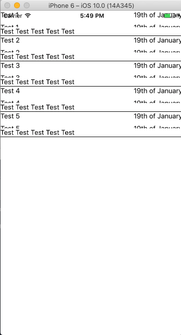
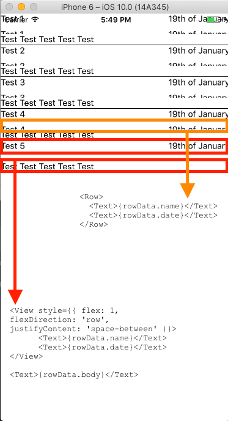
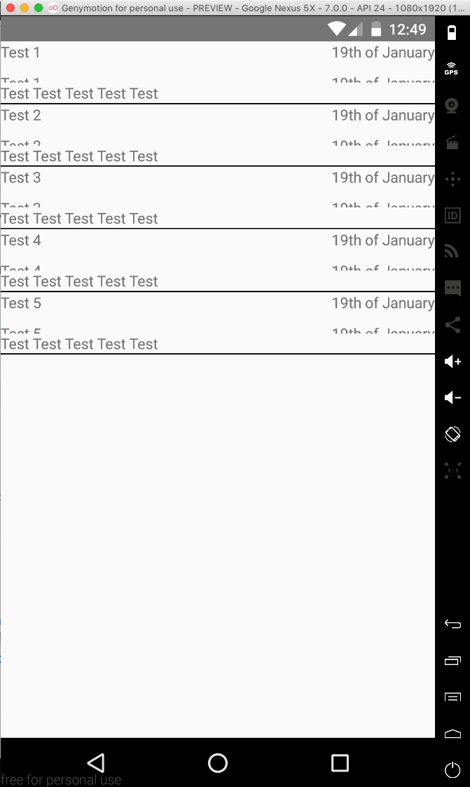

# RNstyledPlayground
Example app to debug a weird bug of a styled.View inside a ListView

I have a `ListView` that renders lines with different components.
The styled.View got cut in render.

## Here a quick preview of the bug:
### iOS    


### Android  


This is the code:
```js
<View style={{ borderBottomWidth: 1 }}>
  <View style={{ flex: 1, flexDirection: 'row', justifyContent: 'space-between' }}>
    <Text>{rowData.name}</Text>
    <Text>{rowData.date}</Text>
  </View>
  <Row>
    <Text>{rowData.name}</Text>
    <Text>{rowData.date}</Text>
  </Row>
  <Text>{rowData.body}</Text>
</View>
```
I'm wondering what's the difference between a `View` and my `Row` component since they have the same style.
